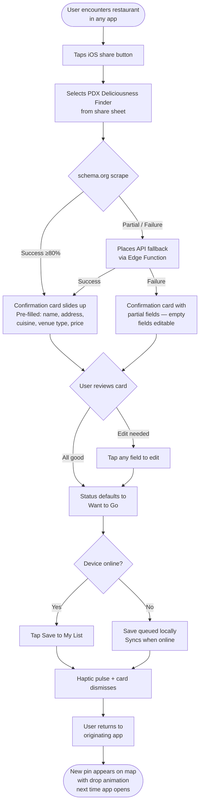
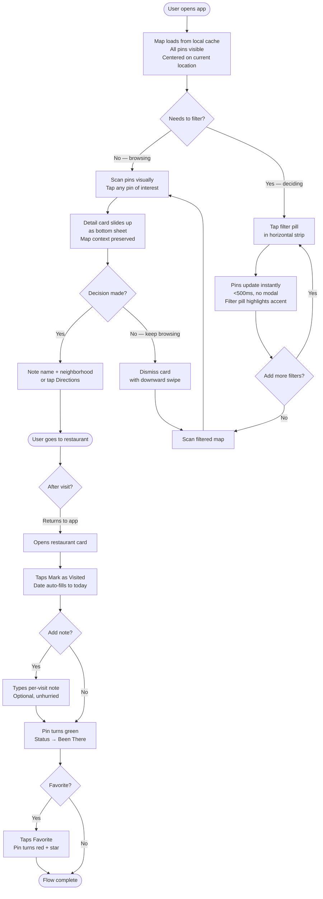
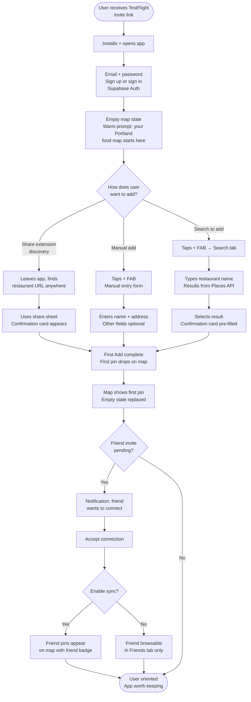
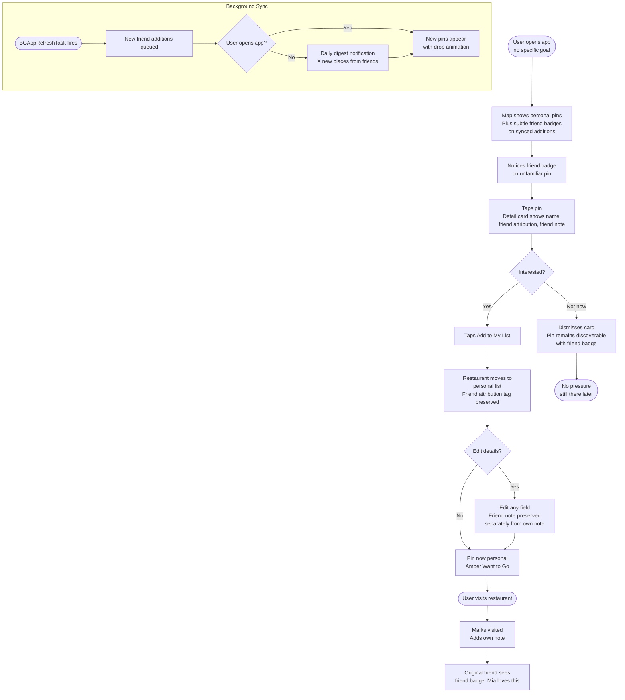
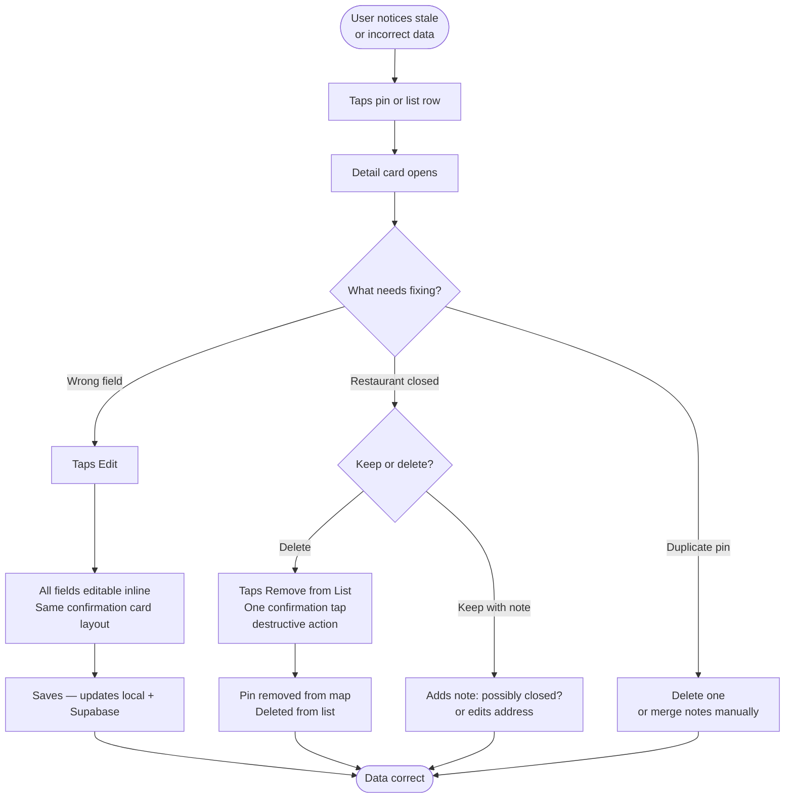

# UX Design Specification PDX Deliciousness Finder

**Author:** Damonbrennen
**Date:** 2026-04-07

---

## Executive Summary

### Project Vision

PDX Deliciousness Finder is a personal, mobile-first restaurant tracker for Portland food enthusiasts — designed to feel like a private journal, not a public directory. It replaces the fragmented workarounds (Google Sheets, Notes apps, Google Maps lists) that fail on a sidewalk when it matters most. The core value moment: standing outside at 7pm and answering "where should we eat?" in 30 seconds by filtering your own curated list on a map.

The product is Portland-specific by design. It serves people who already have taste and a trusted circle — not tourists seeking discovery or strangers writing reviews. Yelp is a mall food court. PDX Deliciousness Finder is a dinner party recommendation.

### Target Users

Portland residents who eat out 3–4 times per week, actively follow local food media (Eater PDX, Instagram food accounts), and collect restaurant recommendations faster than any existing tool can manage. They are mobile-first, often making dining decisions while walking or standing. They value personal curation over crowd-sourced ratings and trust friends' taste over strangers' reviews.

Key user context:
- Primarily iPhone users comfortable with iOS share sheets and native app patterns
- Receive recommendations in context (dinner parties, Instagram stories, food articles) and need zero-friction capture
- Make dining decisions spontaneously while already out — need fast, one-handed, location-aware filtering
- Small trusted circles (3–10 food-savvy friends) rather than large social networks

### Key Design Challenges

1. **The 30-second sidewalk decision** — Map view must load instantly (<2s), filters must be dead-simple to apply one-handed while standing, and results must be visually scannable at a glance. The filter combination flow (status + neighborhood + price simultaneously) must feel effortless, not modal.

2. **Share extension as first-class entry point** — The confirmation card must feel magical (auto-filled from a URL) but trustworthy (every field clearly editable). The transition from the iOS share sheet into the app's confirmation card needs to feel native, fast (<3s), and never like a context switch.

3. **Two-tier social model clarity** — "Connected" (can browse their list) vs "Synced" (their new adds flow into your map) is a novel pattern with no established mental model. The UX must make this distinction immediately understandable without onboarding text or tooltips.

4. **Three-state simplicity** — Want to Go / Been There / Favorite is intentionally opinionated. The UX must make status transitions feel natural (especially the "mark as visited + log notes" flow) while reinforcing the design philosophy: no "meh" state, no ambiguity.

### Design Opportunities

1. **Portland identity as product personality** — Neighborhood labels on the map, warm earthy color palette, food carts as first-class venue type, and hyper-local neighborhood filtering are opportunities to make this feel distinctly Portland in a way no generic restaurant app achieves.

2. **The "aha moment" — personal food geography** — When a user first opens a populated map and sees their Portland food world lit up with color-coded pins, that emotional beat is the product's hook. Design should maximize this first-impression moment.

3. **Friend attribution as trust signal** — The friend badge on map pins and the attribution on restaurant cards ("Mia loves this") turn social data into decision-making confidence. This is where the social layer delivers value without becoming a social network.

4. **Visual prototype as design foundation** — High-fidelity mockups already exist covering all six primary screens (Map, Detail, Share Confirmation, List, Friends, Empty State) with a cohesive iOS-native visual language. This gives the UX specification a strong starting point rather than designing from scratch.

## Core User Experience

### Defining Experience

PDX Deliciousness Finder has a two-pillar core experience:

**Pillar 1: Effortless Capture** — Adding a restaurant must be so fast it doesn't interrupt what you're doing. You're reading an Eater PDX article, at a dinner party, scrolling Instagram — you hit share, the confirmation card appears pre-filled, you tap save. Done. The add flow is the acquisition engine; if it's slow or clunky, the map never fills up, and the product never delivers value.

**Pillar 2: Instant Recall** — When it's time to decide where to eat, the app must surface the right answer from your curated list in under 30 seconds. Open the map or list, apply a filter or two (neighborhood, status, price, cuisine), and the answer is staring at you. No scrolling through a spreadsheet, no searching your memory, no asking Google for stranger opinions. Your own intentions, surfaced at the right moment.

These two pillars feed each other: the easier it is to add, the richer the map becomes; the richer the map, the more useful the recall. The core loop is: **Capture → Curate → Decide → Repeat.**

### Platform Strategy

- **Native iOS (iPhone)** — SwiftUI + MapKit. Touch-first, one-handed operation is a hard design requirement. Many critical interactions happen while standing, walking, or mid-conversation.
- **Share extension as primary entry point** — The iOS share sheet is the front door. The app must appear reliably in the share sheet from Safari, Chrome, Google Maps, Yelp, and restaurant websites.
- **Offline-first** — Map and list must render from local data with zero network dependency. Adds queue locally and sync when connectivity resumes. The app must never show a spinner when you're standing on a sidewalk trying to decide where to eat.
- **Location-aware** — Auto-center the map on the user's current position on launch. Surface "near me" pins naturally. Auto-detect neighborhood from address for filtering.

### Effortless Interactions

| Interaction | Effortless Standard |
|---|---|
| **Add via share extension** | One tap in share sheet → pre-filled confirmation card → one tap to save. Under 5 seconds, one hand, mid-conversation. This is the interaction to optimize above all others. |
| **Filter the map** | Tap a filter pill, pins update instantly (<500ms). Combine filters without opening a modal. Remove a filter with one tap. No "apply" button. |
| **Check a restaurant** | Tap a pin → detail card slides up. All key info (name, cuisine, price, neighborhood, status, notes) visible without scrolling. |
| **Mark as visited** | From the detail card, one tap to mark "Been There." Date auto-fills to today. Note field available but optional. |
| **Switch map ↔ list** | Tab bar tap. Both views respect the same active filters. No re-filtering when switching. |
| **Auto-detection** | Map centers on current location by default. Neighborhood is inferred from address — never manually entered. Venue type and cuisine are pre-filled from URL enrichment where possible. |

### Critical Success Moments

1. **First Add (the hook)** — The user shares a restaurant URL for the first time. The confirmation card slides up with name, address, cuisine, and price already filled in. The user thinks: "Wait, it already knows all this?" This is the moment to optimize for — it's where a new user decides whether the app is worth keeping.

2. **First Populated Map (the aha)** — After 10–15 restaurants, the user opens the map and sees their personal food geography of Portland lit up with colored pins. Amber dots where they want to go, green where they've been, red stars on favorites. This is the emotional payoff of all the adding.

3. **First Successful Decision (the value)** — Standing somewhere in Portland, hungry, the user filters the map and picks a place in under 30 seconds. They walked there because *their own list* told them to. This is the moment the app replaces the Google Sheet permanently.

4. **First Friend Recommendation (the social hook)** — A friend's newly-added restaurant appears on the user's map with a friend badge. The user taps it, reads the friend's note, and adds it to their own list. Trusted signal, zero effort. This is the moment the social layer proves its value.

### Experience Principles

1. **Capture should be invisible** — The act of adding a restaurant should feel like a reflex, not a task. If the user has to think about *how* to add, we've failed. The share extension, pre-filled confirmation card, and smart defaults exist to make capture a sub-5-second muscle memory.

2. **The map is the product** — Every design decision should make the map more useful, more readable, and more delightful. The map is where the core value lives — your personal Portland food world, visualized. List view is the complement, not the competitor.

3. **Filters, not search** — Users don't search their own list by keyword. They filter by context: "What do I want to try in this neighborhood, at this price point?" Filter UX must be fast, combinable, and visible — never buried behind a search icon.

4. **Personal first, social second** — The app is a personal journal that happens to have a trusted social layer. Every social feature must enhance the personal experience without adding noise, obligation, or performance anxiety. No follower counts, no public profiles, no review prompts.

5. **Speed is a feature** — Map load under 2 seconds. Filters under 500ms. Add under 5 seconds. If any of these feel slow, the user goes back to their Notes app. Offline-first architecture exists to guarantee this speed regardless of connectivity.

## Desired Emotional Response

### Primary Emotional Goals

**Delight** — The primary emotion. Portlanders love food, and this app lets them see all the places they're personally excited about, beautifully arranged on their own map. Opening the app should feel like opening a treasure chest of future meals — not like opening a tool. Every interaction should carry a small spark of joy: the auto-filled confirmation card, the colorful pins populating the map, the friend badge appearing on a new recommendation.

**Ownership** — This is *your* food map. Not a public directory, not an algorithm's suggestion, not a stranger's review. Every pin on the map represents a personal decision — a place you heard about, a place you loved, a place a trusted friend swears by. The app should feel like it belongs to you in a way that Yelp never could.

**Confidence** — When it's decision time, the user should feel certain, not overwhelmed. The app turns "I don't know where to eat" into "I have five great options right here." Confidence comes from curation — because every restaurant in the list was personally chosen, every result from a filter is already pre-approved by the user's own taste.

### Emotional Journey Mapping

| Stage | Desired Feeling | Design Implication |
|---|---|---|
| **First launch** | Curious and welcomed | Clean empty state with a warm, inviting prompt — not a barren screen. One clear action: "Add your first place." |
| **First add (share extension)** | Surprised delight | The auto-filled confirmation card is the magic trick. The feeling: "It just *knew*." Quick, satisfying, makes you want to add another. |
| **Building the list (5–15 places)** | Growing excitement | Each new pin on the map adds to the visual richness. The map starts to feel *yours*. Momentum builds naturally. |
| **First populated map** | Pride and delight | "Look at my food map of Portland." This is the aha moment — a visual representation of your taste and your city. It should feel personal and beautiful. |
| **Decision moment (filtering)** | Calm confidence | Filters narrow the noise instantly. The answer surfaces without stress. The feeling: "I've got this." |
| **After visiting a restaurant** | Quiet satisfaction | Marking a place as visited and adding a note feels like writing in a journal. Personal, unhurried, reflective. |
| **Seeing a friend's recommendation** | Warm trust | A friend badge on a pin is a quiet signal: someone you trust loved this place. No pressure, no notification overload — just a good lead. |
| **Error or failed parse** | Unbothered | The app catches it gracefully. Partial data? Show what we have, let the user fill the rest. Offline? Queue it silently. The user should never feel punished for a technical limitation. |
| **Returning to the app** | Familiar comfort | Like reopening a favorite notebook. Everything is where you left it. Maybe a new friend pin appeared. The map is a living document of your Portland food life. |

### Micro-Emotions

**Prioritized emotional pairs:**

1. **Delight over mere satisfaction** — The app should never feel like "it works." It should feel like "I love this." Small moments of visual pleasure (pin colors, smooth animations, the confirmation card slide-up), not just functional correctness. The difference between a tool and a companion.

2. **Confidence over confusion** — Every screen should make the user feel oriented. No mystery meat navigation, no ambiguous icons, no "what does this button do?" moments. The three-state system (Want / Been / Fav) is simple enough that it never requires explanation.

3. **Belonging over isolation** — The friend layer should make the user feel gently connected to their circle. Not socially pressured, not performing, not competing — just sharing good taste with people they trust. The absence of follower counts, public profiles, and review prompts is itself an emotional design choice.

**Emotions to actively avoid:**

- **Performance anxiety** — No review prompts, no ratings, no "share your experience" nudges. This is not a stage.
- **FOMO or social pressure** — Friend sync should feel like a gift, not an obligation. No notification spam.
- **Overwhelm** — The filter system exists to reduce options, not present them. A filtered map with 3 pins is more valuable than an unfiltered map with 50.
- **Guilt** — No "you haven't visited in a while" nudges. No engagement tricks. The app is patient.

### Design Implications

| Emotional Goal | UX Design Approach |
|---|---|
| **Delight** | Warm color palette (the mockup's earthy Portland tones), smooth micro-animations on pin appearances and card transitions, satisfying haptic feedback on save actions. The confirmation card auto-fill should feel like a small magic trick. |
| **Ownership** | User's initial on the map search bar (as shown in mockup), "My List" as the list view title, personal notes front and center on restaurant cards. No algorithmic suggestions — every pin is user-placed. |
| **Confidence** | Filter pills always visible (not hidden behind a button), instant filter response, clear visual hierarchy on the map (status colors + venue icons readable at a glance). The map should be scannable in 2 seconds. |
| **Graceful resilience** | Partial enrichment shows what it found + editable empty fields (never an error modal). Offline state is invisible — the app just works. Failed sync retries silently. If a URL can't be parsed at all, the app pivots to manual entry with a friendly nudge, not an error message. |
| **Non-performative intimacy** | No public profiles, no follower counts, no "X people saved this." Friend badges are small and informational, not social proof metrics. Notes are private reflections, not reviews for an audience. |

### Emotional Design Principles

1. **Joy in the ordinary** — The app handles a mundane task (tracking restaurants) but should make it feel like a small pleasure. Color, motion, and polish turn a utility into something you enjoy opening.

2. **Quiet over loud** — No notification badges screaming for attention, no gamification, no streaks. The app respects the user's time and attention. It's there when you need it and invisible when you don't.

3. **Graceful degradation, not failure** — Every error state has a soft landing. Partial data is a slower success, not a failure. Offline is a feature, not a limitation. The user should never feel like the app let them down.

4. **The anti-Yelp** — Every design choice should pass the test: "Would Yelp do this?" If yes, reconsider. No star ratings, no review counts, no "trending" labels, no stranger opinions. The emotional opposite of a public review platform is a private curation journal.

5. **Warmth over polish** — The app should feel handcrafted and Portland-specific, not Silicon Valley sleek. The earthy palette, neighborhood labels, and food-cart-as-first-class-citizen all contribute to warmth. Personality over perfection.

## UX Pattern Analysis & Inspiration

### Inspiring Products Analysis

**Spotify — The Personal Collection Standard**

Spotify is the gold standard for making a personal collection feel like *yours*. Key UX lessons:
- **Playlists as identity** — A Spotify playlist isn't just a list of songs; it's a reflection of taste. PDX Deliciousness Finder's map should evoke the same pride: "This is my Portland food map" the way "This is my playlist" works.
- **Zero-friction add** — Adding a song to a playlist is one long-press + one tap. The share extension confirmation card should feel equally effortless.
- **Visual richness from content** — Spotify uses album art to make playlists feel alive. PDX Deliciousness Finder uses colored pins on a real map — the visual richness comes from the user's own data, not from stock imagery.
- **Browse vs. decide modes** — Spotify supports both idle browsing (exploring your library) and intent-driven play (searching for something specific). The map view serves both: casual browsing ("what's on my map?") and active decision-making ("where should I eat in NW?").

**Headspace — Warmth and Delight in Utility**

Headspace turns a utilitarian activity (meditation) into something that feels warm, inviting, and delightful. Key UX lessons:
- **Earthy, warm color palette** — Headspace uses soft, rounded, organic colors that feel calming and approachable. This aligns directly with the "warmth over polish" emotional principle and the mockup's earthy Portland tones.
- **Illustration and personality** — Headspace has a distinct visual identity that feels handcrafted, not corporate. PDX Deliciousness Finder should feel similarly personal — Portland-specific, not generic-app-sleek.
- **Gentle onboarding** — Headspace doesn't overwhelm new users. One clear action, encouraging language, no feature dump. The empty state mockup ("Your Portland food map starts here") follows this pattern.
- **Micro-animations that feel rewarding** — Small, satisfying animations on completion or state changes. The pin appearing on the map after a save, the status color changing when marking "Been There" — these moments deserve the same care.

**NYT Games — Simple, Satisfying, Ritual**

NYT Games (especially Wordle and Connections) nails the "open it, do the thing, feel good" loop. Key UX lessons:
- **Extreme simplicity** — The interface has almost nothing on it except the game. No clutter, no upsells on the game screen. The map view should aspire to this: pins, filters, your location — nothing else competing for attention.
- **Satisfying completion feedback** — The color-flip animation in Wordle, the category reveal in Connections. When a user saves a restaurant or marks one as visited, the feedback should feel equally satisfying (haptic + visual).
- **No guilt mechanics** — NYT Games doesn't punish you for missing a day. PDX Deliciousness Finder should never nag. The app is patient — it's there when you want it.
- **Word-of-mouth shareability** — People share Wordle results because it's easy and fun, not because the app begs them to. The "look at my food map" moment should be naturally shareable without a "Share" button being the primary CTA.

**NYT Cooking — Editorial Curation in a Personal Context**

NYT Cooking (Food) handles the recipe-saving UX well. Key UX lessons:
- **Save and organize from editorial content** — Users read an article, save a recipe. PDX Deliciousness Finder's share extension is the same pattern: read about a restaurant, share the URL, save it. The flow from discovery to capture should feel just as natural.
- **Personal recipe box** — The saved recipes collection feels personal but functional. Good filtering, clean presentation, easy to find what you saved. The list view should aspire to this level of browsable organization.
- **Notes on saved items** — NYT Cooking lets you add personal notes to recipes ("doubled the garlic, worked great"). The per-restaurant and per-visit notes serve the same purpose: personal annotations on curated items.

**Google Maps — Map Interaction Baseline**

Google Maps defines user expectations for map-based interactions. Key UX lessons:
- **Saved places as a feature** — Google Maps proved users want to save places to lists. Its limitation: lists are flat, unsocial, and hard to filter. PDX Deliciousness Finder improves on this with status coding, friend attribution, and real filtering.
- **Pin interaction model** — Tap pin → info card slides up from bottom. This is now a learned behavior across all map apps. The mockup follows this pattern correctly.
- **Search bar at top of map** — Standard placement. The mockup matches.
- **Where Google Maps fails for this use case** — No status tracking, no personal notes, no friend layer, no venue-type filtering, no neighborhood-level awareness. These are the gaps PDX Deliciousness Finder fills.

**Eater — The Recommendation Source**

Eater (especially Eater PDX) is where many target users discover restaurants. Key UX lessons:
- **Neighborhood-based organization** — Eater organizes by Portland neighborhood, which is exactly how locals think about dining. The neighborhood filter is critical.
- **Trusted editorial voice** — Eater's value is curation by people who know Portland food. PDX Deliciousness Finder extends this: your *personal* curation plus your *friends'* curation replaces an editor's picks with picks from people you actually trust.
- **The handoff problem** — Users read Eater, find a restaurant they want to try, and then... copy the name into a spreadsheet? Screenshot the article? This is the exact friction the share extension solves. Eater → share → confirmation card → saved.

### Transferable UX Patterns

**Navigation Patterns:**

| Pattern | Source | Application to PDX Deliciousness Finder |
|---|---|---|
| Tab bar with 4 primary destinations | Spotify, Google Maps | Map / List / Friends / Settings — already in the mockup. Proven, learnable, one-tap access. |
| Bottom sheet for detail views | Google Maps, Apple Maps | Restaurant detail card as a draggable bottom sheet over the map. Maintains map context while showing detail. |
| Filter pills (horizontal scroll) | Spotify (mood filters), Eater (neighborhood filters) | Status + venue type + neighborhood + cuisine + price as scrollable pills below the search bar. Visible, tappable, combinable. |

**Interaction Patterns:**

| Pattern | Source | Application to PDX Deliciousness Finder |
|---|---|---|
| Long-press / share to add | Spotify (add to playlist) | Share extension as the primary add gesture. One action from any app. |
| Swipe to reveal actions | NYT Cooking (delete/edit on saved recipes) | Swipe on list items to reveal quick actions (mark visited, edit, delete). |
| Pull-to-refresh | Standard iOS | Trigger friend sync refresh on the map or list view. |
| Satisfying save confirmation | Headspace (session complete animation) | After saving a restaurant: brief haptic pulse + pin animation dropping onto the map. |

**Visual Patterns:**

| Pattern | Source | Application to PDX Deliciousness Finder |
|---|---|---|
| Warm, organic color palette | Headspace | Earthy Portland tones: warm stone backgrounds, rust/orange accent, amber/green/red status colors. Not cold blue/white tech aesthetic. |
| Content-as-visual-richness | Spotify (album art fills the UI) | The map pins ARE the visual design. A full map of colored pins is beautiful because of the user's data, not because of stock photography. |
| Clean card-based detail views | NYT Cooking (recipe cards) | Restaurant detail card: clean typography, clear hierarchy, personal notes prominent, status badge visible. |
| Minimal chrome on primary view | NYT Games (game screen) | Map view should be almost all map. Search bar, filter pills, tab bar — nothing else competing with the pins. |

### Anti-Patterns to Avoid

| Anti-Pattern | Why It Fails | Source of Lesson |
|---|---|---|
| **Modal filter screens** | Interrupts the map context; adds taps. Filters should be inline pills, not a separate screen. | Google Maps saved lists (buried filters) |
| **Onboarding carousels** | Users skip them. The empty state should teach by doing ("share a URL to add your first place"), not by showing slides. | Generic app patterns |
| **Social engagement metrics** | Follower counts, "X people saved this," review prompts — all create performance anxiety. Antithetical to the personal journal feeling. | Yelp, Instagram |
| **Notification overload** | Push for every friend action kills delight. Daily digest only, opt-out available. | Most social apps |
| **Hamburger menus** | Hide navigation and reduce discoverability. Tab bar is always better for 4 or fewer primary destinations. | Outdated mobile patterns |
| **Skeleton screens for local data** | If data is local (offline-first), there's no reason to show loading placeholders. The map and list should appear instantly. | Over-engineered loading states |
| **"Rate this app" prompts** | Guilt mechanic. If the app is good, users will rate it on their own. Matches the "no guilt" emotional principle. | Most App Store apps |

### Design Inspiration Strategy

**Adopt Directly:**
- Spotify's "personal collection as identity" philosophy — the map is your food identity
- Headspace's warm, earthy color approach — already aligned with the mockup palette
- Google Maps' pin → bottom sheet interaction model — learned behavior, don't reinvent
- NYT Games' "no guilt, no nag" restraint — patience as a design value
- NYT Cooking's save-from-editorial-content flow — the share extension is this pattern perfected

**Adapt for PDX Deliciousness Finder:**
- Spotify's playlist browsing → map/list browsing with shared filter state across both views
- Headspace's micro-animations → subtle, satisfying feedback on save, status change, and filter actions (keep it light — this is a utility, not a meditation app)
- Eater's neighborhood organization → neighborhood as a first-class filter dimension, with Portland-specific neighborhood boundaries

**Avoid Entirely:**
- Yelp's public review model — no ratings, no stranger opinions, no engagement prompts
- Google Maps' flat, unfiltered saved lists — the whole point is better filtering and status tracking
- Any gamification (streaks, badges, levels) — conflicts with "quiet over loud" principle
- Any algorithmic recommendation ("You might also like...") — every pin is user-placed, period

## Design System Foundation

### Design System Choice

**Apple Human Interface Guidelines (HIG) + Custom Portland Theme**

PDX Deliciousness Finder uses Apple's native SwiftUI design system as its foundation, extended with a custom visual theme that delivers the warm, Portland-specific personality defined in our emotional and experience principles.

This is not a compromise — it's the correct choice for a native iOS app. SwiftUI provides battle-tested components for navigation, sheets, tab bars, buttons, lists, and maps. The custom layer focuses exclusively on what makes this app unique: the pin system, the confirmation card, the filter pills, and the earthy Portland color palette.

### Rationale for Selection

| Factor | Decision Driver |
|---|---|
| **Platform** | Native iOS / SwiftUI — Apple's own design system is the natural foundation. Fighting it creates friction; leveraging it creates polish. |
| **Development model** | Solo + AI-assisted. Native components reduce code surface area and bug potential. Custom components are reserved for genuinely novel interactions. |
| **Accessibility** | HIG compliance gives Dynamic Type, VoiceOver, color contrast, and 44pt tap targets for free. Building these from scratch would be a significant tax. |
| **Dark Mode** | SwiftUI's semantic color system handles light/dark mode adaptation automatically when design tokens are defined correctly. |
| **Performance** | Native components render faster than custom equivalents. Map view with 50+ pins and real-time filtering needs every performance advantage. |
| **User expectations** | iOS users expect native interaction patterns (swipe-back, bottom sheets, pull-to-refresh, haptics). Deviating from these creates cognitive friction. |
| **Visual uniqueness** | The app's visual identity comes from its content (colored pins on a Portland map) and its custom theme (earthy palette, warm typography), not from reinventing standard controls. |

### Implementation Approach

**Native SwiftUI Components (use as-is):**
- `NavigationStack` — screen navigation
- `TabView` — 4-tab primary navigation (Map, List, Friends, Settings)
- `.sheet` / `.fullScreenCover` — modal presentations
- `List` / `ScrollView` — list view, friends tab, settings
- `Map` (MapKit) — primary map view
- `TextField` / `TextEditor` — form inputs, notes, manual add
- `Button` / `Toggle` / `Picker` — standard controls
- System haptics (`.sensoryFeedback`)
- Pull-to-refresh (`.refreshable`)
- Swipe actions (`.swipeActions`)

**Custom Components (build for uniqueness):**
- **Map Pin** — Custom `MapAnnotation` with venue-type icon, status color, favorite star, and friend badge. This is the most visible custom component.
- **Confirmation Card** — Bottom sheet with pre-filled fields, status selector, and save button. Used by both share extension and manual add flows.
- **Filter Pills** — Horizontal scrolling pill bar with multi-select, active state styling, and instant filter application. Not a standard SwiftUI component.
- **Restaurant Detail Card** — Draggable bottom sheet over the map with status badge, notes, visit history, and action buttons.
- **Status Badge** — Colored indicator (amber/green/red) with label, used across map pins, list items, and detail cards.
- **Friend Badge** — Small avatar indicator on pins and restaurant cards showing friend attribution.
- **Empty State** — Illustrated prompt for first-time users, matching the mockup's warm onboarding style.

### Customization Strategy

**Design Tokens (defined in `UI/Theme/`):**

The custom theme is expressed through SwiftUI design tokens that override or extend the system defaults:

- **Colors** — Custom `Color` extensions for the Portland palette: accent (rust/orange), status colors (amber, green, red), friend badge color, backgrounds, text hierarchy, borders. All defined with light/dark mode variants.
- **Typography** — System font (SF Pro) with custom size/weight scale. No custom typeface needed — SF Pro is warm enough when paired with the right colors and spacing. Font sizes respect Dynamic Type.
- **Spacing** — Consistent spacing scale (4pt base) for margins, padding, and gaps.
- **Corner Radius** — Rounded corners matching the mockup's soft, approachable feel (large radius on cards and sheets, pill radius on filter chips).
- **Shadows** — Subtle, warm-toned shadows on cards and floating elements (not cold gray shadows).
- **Animation** — Spring-based animations for pin drops, card reveals, and filter transitions. Subtle, not showy — Headspace-inspired, not Snapchat-inspired.

**Theme Application Rule:**

Every custom visual property is defined once in `UI/Theme/` and referenced everywhere. No hardcoded colors, font sizes, or spacing values in feature code. This ensures the Portland personality is consistent across every screen and makes future adjustments (e.g., seasonal color tweaks) trivial.

## Detailed Core Experience

### Defining Experience

**"Share any restaurant URL and it's instantly on your personal Portland food map."**

This is the one-sentence description that captures the entire product. It contains both pillars in a single gesture: the effortless capture (share a URL) and the instant recall (it's on your map). The map is the payoff of every add — you're not saving to a list, you're placing a pin on your personal food geography of Portland.

The defining experience is not a single interaction but a pipeline:

1. **Encounter** — You hear about a restaurant (article, friend, Instagram, dinner party conversation)
2. **Capture** — You share the URL from whatever app you're in. Confirmation card appears pre-filled. One tap to save.
3. **Accumulate** — Your map fills with colored pins over days and weeks. Each pin is a future meal or a past memory.
4. **Decide** — You and your partner are at home, deciding where to go tonight. You open the map, apply a filter or two, and pick from your own curated options.

Steps 1–3 happen in scattered moments throughout the week. Step 4 is the value moment — the reason all the capturing exists.

### User Mental Model

**How users currently solve this:**
- **Google Maps saved places** — Hard to get to, clunky interface, no filtering, no status tracking, no social layer. The data is there but the access is painful.
- **Google Sheets / spreadsheets** — Manual entry for everything (name, address, cuisine, notes). Not visual. Not usable on a sidewalk. Degrades over time as the sheet gets long and disorganized.
- **Notes app** — Unstructured text dump. No filtering, no map, no way to find "that Thai place someone mentioned last month."
- **Memory** — Works until you're standing somewhere hungry and can't remember any of the places you've been meaning to try.

**What all current solutions share:** The adding is manual and tedious, and the retrieval is either impossible or painful. None of them connect capture to a visual, filterable, location-aware interface.

**The mental model PDX Deliciousness Finder replaces:** "I'll remember" or "I'll write it down somewhere" → "I'll share it and it's on my map."

**The retrieval mental model:** Instead of "let me search my spreadsheet" or "let me scroll through my notes," the user thinks: "Let me open my map and see what's around" or "Let me filter for what I'm in the mood for." The map turns a recall task (memory) into a recognition task (visual scanning). Recognition is always easier than recall.

### Success Criteria

| Criteria | Metric | Why It Matters |
|---|---|---|
| **Add feels instant** | URL share → saved in under 5 seconds | If adding feels like work, users stop adding. The map stays empty. The product fails. |
| **Confirmation card is mostly right** | 80%+ of fields pre-filled correctly | The "magic" feeling depends on the card already knowing the restaurant's name, address, cuisine, and price. If users have to type everything, it's just a fancy form. |
| **Map is immediately useful** | All pins render in under 2 seconds | The map IS the product. If it's slow, the defining experience breaks. |
| **Filtering feels effortless** | Filter applied → results updated in under 500ms, no modals | The decision moment (at home deciding where to go) depends on fast, combinable filters. If filtering requires multiple taps and a separate screen, users just scroll aimlessly. |
| **"Where should we eat?" is answered** | User can go from app open to decision in under 30 seconds | This is the value moment. If the app doesn't answer this question faster than looking at your Google Sheet, it hasn't earned its place on the home screen. |
| **Users stop using their old system** | Primary user abandons Google Sheet (or equivalent) within 4 weeks | The ultimate success metric. Behavior change is the only real validation. |

### Novel UX Patterns

**Established patterns (leverage, don't reinvent):**
- Tab bar navigation (Map / List / Friends / Settings) — universal iOS pattern
- Pin → bottom sheet detail card — learned from Google Maps and Apple Maps
- Share extension as entry point — established iOS pattern, but rarely used as the *primary* add gesture
- Pull-to-refresh, swipe actions, haptic feedback — standard iOS vocabulary

**Novel combinations (familiar patterns, new arrangement):**
- **URL-as-primary-add** — Most restaurant apps use search-to-add or manual entry. Making the share extension the *primary* entry point (not a secondary convenience) is novel. Users don't need to learn a new gesture — they already know how to share a link — but the app's reliance on it as the front door is unusual and needs the confirmation card to feel trustworthy.
- **Status-coded map as personal curation** — Google Maps has saved places; Beli has restaurant tracking. Neither combines a color-coded status system (Want / Been / Fav) with venue-type icons on a single personal map. The visual language of the pins is the novel element.
- **Two-tier social without a social network** — Connected vs. Synced as independent states. No established app does this. The UX must make the distinction learnable through the toggle UI, not through explanation text.

**Education strategy for novel patterns:**
- Share extension: The empty state prompts "Share a URL to add your first place" — teaches the primary gesture at the moment of highest motivation.
- Two-tier social: The Friends tab shows each friend with a visible sync toggle. The toggle label and state should be self-explanatory: "Sync on" means their adds appear on your map; "Sync off" means you can still browse their list manually.
- No onboarding carousel. Learning happens through doing.

### Experience Mechanics

**Primary Flow: Share → Save → Map**

**1. Initiation:**
- User is in Safari, Chrome, Google Maps, Yelp, Instagram, or any app with a share sheet
- User finds a restaurant URL they want to save
- User taps the iOS share button and selects PDX Deliciousness Finder from the share sheet

**2. Interaction:**
- Confirmation card slides up as a bottom sheet
- Fields are pre-filled: name, address, cuisine, venue type, price (from schema.org scrape or Places API fallback)
- Status defaults to "Want to Go" (most common case for a new add)
- User can edit any field with a tap, or leave defaults
- User taps "Save to My List"

**3. Feedback:**
- Haptic pulse on save (medium impact)
- Card dismisses with a smooth downward slide
- If the user opens the app later, the new pin appears on the map with a brief drop animation
- The pin is color-coded (amber for Want to Go) with the correct venue-type icon

**4. Completion:**
- The restaurant is now on the map and in the list
- No further action required
- The user returns to whatever app they were in (share extension closes)

**Secondary Flow: Open Map → Filter → Decide**

**1. Initiation:**
- User opens the app (tap icon on home screen)
- Map view loads immediately from local data (offline-first)
- Map is centered on user's current location (or last viewed area)
- All pins visible by default

**2. Interaction:**
- User taps filter pills below the search bar
- Active filters highlight in accent color; inactive filters are neutral
- Pins update instantly as filters are applied/removed
- User scans the map visually for a cluster of pins in the right area
- User taps a pin to see the detail card

**3. Feedback:**
- Filter pills toggle with a subtle color animation
- Pins that don't match the filter fade or disappear smoothly (not a jarring redraw)
- Detail card slides up from bottom, showing name, cuisine, price, neighborhood, status, notes, and friend attribution if any

**4. Completion:**
- User decides on a restaurant
- Optionally taps "Directions" to open Apple Maps, or just remembers the name and neighborhood
- After visiting, user can return to the detail card to mark as visited and add notes

## Visual Design Foundation

### Color System

**Baseline:** [Delicious-screens](https://github.com/mrdamonb/Delicious-screens) (`src/index.css` / `src/constants.ts`). All semantic tokens below map 1:1 to the prototype for light mode; SwiftUI implements them as named colors in `UI/Theme/` with Dark Mode variants tuned to preserve contrast (not a straight color invert).

| Token | Hex | Role |
|---|---|---|
| **Background** | `#F7F3EE` | App canvas, map-adjacent areas, warm paper feel |
| **Surface** | `#FFFFFF` | Cards, search bar, filter pills (inactive), sheets |
| **Text primary** | `#1C1917` | Headlines, primary labels, tab bar / nav chrome |
| **Text secondary** | `#6B6560` | Subtitles, metadata, placeholders, de-emphasized list copy |
| **Border / divider** | `#EDE8E3` | Hairlines, card edges, pill outlines |
| **Accent (primary action)** | `#C2410C` | Primary buttons, selected filter pill, FAB, links |
| **Status — Want to go** | `#F59E0B` | Pin fill, status dot, “want” affordances |
| **Status — Been there** | `#16A34A` | Pin fill, status dot, visited state |
| **Status — Favorite** | `#DC2626` | Pin fill, favorite star, “fav” affordances |
| **Friend attribution** | `#7C3AED` | Friend badge, sync/active friend accents |
| **Tab bar / device chrome (mockup)** | `#1C1917` | In prototype: dark tab bar; in native app follow system tab bar appearance unless a deliberate dark chrome is chosen — document per build |

**Semantic mapping (implementation names):**
- `PDXBackground`, `PDXSurface`, `PDXTextPrimary`, `PDXTextSecondary`, `PDXBorder`
- `PDXAccent`
- `PDXStatusWant`, `PDXStatusBeen`, `PDXStatusFavorite`
- `PDXFriend`

**Accessibility:** Status must never rely on color alone — pins use **venue-type icon + color** (per PRD). Favorite adds a **star** affordance in the prototype; native app preserves icon + color + label where status is communicated in UI.

### Typography System

**Typeface:** **SF Pro** (system). The prototype uses Inter for web; native uses SF Pro for zero embedding cost, full Dynamic Type support, and HIG alignment.

**Tone:** Friendly, readable, slightly editorial — warm colors carry personality; type stays clear and efficient.

**Scale (efficient density — default / content sizes, all scale with Dynamic Type):**

| Role | Approx default | Weight | Use |
|---|---|---|---|
| **Large title** | ~34pt | Bold | Screen titles (“My List”, “Friends”) |
| **Title 2** | ~22pt | Bold | Restaurant name on detail card |
| **Headline** | ~17pt | Semibold | Section headers, emphasized rows |
| **Body** | ~15–17pt | Regular | Primary reading, form fields |
| **Subhead / metadata** | ~13–15pt | Regular | Cuisine · price · neighborhood |
| **Caption / tab label** | ~10–13pt | Medium | Tab bar, pills, timestamps |

**Line height:** Slightly tight for list and map chrome (efficient layout); relax line height on note blocks and long copy.

**Rules:** Use Dynamic Type text styles (`Font.TextStyle`) where possible; avoid fixed sizes on primary content. Uppercase tracking only for small labels (e.g. primary button) as in the mockup — use sparingly.

### Spacing & Layout Foundation

**Density:** **Efficient** — prioritize visible map area and scannable list rows over generous whitespace. Padding is intentional but not airy.

**Base unit:** **4pt** grid. Common steps: 4, 8, 12, 16, 24 (use 24 sparingly for section breaks).

**Screen margins:** **16pt** horizontal on phones (standard); map search bar and filter strip align to this inset.

**Components (targets):**
- **Filter pills:** Compact vertical padding (~8pt), horizontal ~16pt per pill, **8pt** gap between pills in horizontal scroll.
- **List rows:** **~64pt** minimum row height where possible while meeting 44×44pt minimum **tap targets** for chevrons and actions (PRD / HIG).
- **Floating add (FAB):** **56×56pt** outer tap target; visual circle may be slightly smaller if hit area is extended.
- **Bottom sheet:** Top corner radius **~40pt** (mockup: large continuous curve); handle **~4pt** height for affordance.

**Grid:** No multi-column grid on iPhone primary flows; use full-width stacks. Map and list share the same horizontal margins for visual continuity.

### Accessibility Considerations

- **Dynamic Type:** All primary text uses scalable styles; test large accessibility sizes on map labels, list rows, and confirmation card.
- **Contrast:** Accent `#C2410C` and status colors on white/light surfaces must meet **WCAG AA** for text and critical icons; adjust dark-mode equivalents if needed.
- **Color independence:** Status communicated with **icon + color** on pins and in lists; VoiceOver labels include status and venue type.
- **Touch targets:** Minimum **44×44pt** for interactive controls (filters, tabs, FAB, sheet actions).
- **Reduce Motion:** Respect `accessibilityReduceMotion` — replace springy pin/sheet animations with short fades or instant updates.

## Design Direction Decision

### Design Directions Explored

Six design directions were generated and evaluated, each applying the same visual foundation (earthy Portland palette, SF Pro typography, Apple HIG base) with a different personality:

1. **Portland Journal** — Warm, editorial, personal. "Private food journal" metaphor. Generous card spacing, soft shadows, warm paper canvas (`#F7F3EE`). Closest to Headspace warmth + NYT Cooking organization.
2. **Cartographer** — Map-maximalist. Full-bleed map with translucent glass overlays for all chrome. Compact detail peeks. Closest to Apple Maps' immersive approach.
3. **Neighborhood Local** — Portland neighborhoods as the primary visual organizing principle. Sectioned lists with bold neighborhood headers. Map with subtle boundary overlays.
4. **Pin Forward** — Larger, bolder, illustrated pins as the hero visual. Map as a canvas for pin art. More playful and personality-forward.
5. **Dark Kitchen** — Dark-mode-first. Moody, intimate, restaurant-menu-inspired. Status colors glow against dark surfaces. Chef's-notebook energy.
6. **Trusted Circle** — Social-forward. Prominent friend avatars on the map, "via [friend]" callouts, My Places / Friends' Picks layer toggle.

### Chosen Direction

**Portland Journal** — selected as the primary design direction.

This direction best serves the product's core identity: a personal, warm, private food journal that happens to have a trusted social layer. The editorial warmth, generous card spacing, and warm paper canvas reinforce the "anti-Yelp" positioning without sacrificing efficiency for the decision-moment use case.

### Pin System Decision

Pin treatment was explored separately with a dedicated side-by-side comparison of round circles (prototype style) vs. upright teardrops.

**Chosen shape: Upright teardrop** — point-down, straight-on (no rotation). Provides stronger location semantics on the map while remaining clean and modern.

**Venue-type icons (SF Symbols in native iOS):**

| Venue Type | Icon | SF Symbol Reference |
|---|---|---|
| Restaurant | Fork & knife (utensils) | `fork.knife` |
| Bar | Martini glass | `wineglass` |
| Brewery | Beer mug | `mug.fill` |
| Food Cart | Cart pod structure | `house.fill` variant / custom |

**Status-driven pin behavior:**

| Status | Fill Color | Icon Treatment | Size | Extras |
|---|---|---|---|---|
| Want to Go | Amber (`#F59E0B`) | Venue-type icon | Standard (34×42pt) | — |
| Been There | Green (`#16A34A`) | Checkmark (replaces venue icon) | Standard | — |
| Favorite | Red (`#DC2626`) | Venue-type icon preserved | Large (38×46pt) | Star above pin |

**Note:** Been There pins use a checkmark in place of the venue icon. Venue type remains recoverable via filter combination (status filter + venue type filter). This is an intentional trade-off favoring pin simplicity and map scannability over per-pin information density.

**Favorite pin visual hierarchy:** The larger size + star above is intentional design, not decoration. On a dense map, a user's favorites naturally draw the eye first — directly serving the 30-second decision moment. The best places grab attention without any filter needed.

**Friend attribution:** Small purple (`#7C3AED`) circle badge on the bottom-right of the pin, with white border. Applied to any pin originating from a synced friend.

### Design Rationale

| Factor | Why Portland Journal Wins |
|---|---|
| **Emotional alignment** | Directly serves "ownership," "delight," and "confidence" goals. The warm paper canvas and editorial spacing make the app feel like *yours*. |
| **Core use case** | The balanced map emphasis leaves room for the detail card — where notes, visit history, and personal voice live. Critical for the journal metaphor. |
| **Anti-Yelp principle** | The warm, handcrafted aesthetic is the visual opposite of Yelp's cold utility. Warmer, quieter, and more personal at every touch point. |
| **Social balance** | Friend attribution is present but subtle — not the hero element. Matches "personal first, social second" principle. |
| **Implementation complexity** | Straightforward. Leverages standard HIG components with a custom theme layer. No exotic layout or rendering requirements. |
| **Pin system** | Upright teardrop with clean vector icons is readable at small sizes, provides clear location pointing, and supports the full status/venue matrix without visual clutter. |

### Implementation Approach

- **Canvas:** Warm paper background (`#F7F3EE`) as the app-wide canvas, with white (`#FFFFFF`) surface cards for content areas.
- **Cards & sheets:** Generous padding (16–20pt), large corner radius (~20pt on cards, ~40pt on bottom sheets), subtle warm-toned shadows.
- **Typography:** SF Pro at the established scale. Editorial tone carried through weight contrast (bold headlines, regular body) rather than custom typefaces.
- **Pins:** Custom `MapAnnotation` using upright teardrop SVG shape with SF Symbol icons. Rendered as SwiftUI views inside `MapAnnotation` — enables dynamic color and icon swapping based on status and venue type. Keeps the pin system maintainable as venue types potentially expand post-MVP.
- **Transitions:** Spring-based animations (Headspace-inspired) for pin drops, card reveals, and filter toggles. Subtle, not showy. Respect `accessibilityReduceMotion`.
- **Dark Mode:** Design tokens in `UI/Theme/` with dark mode variants. Dark mode is supported but Portland Journal is a warm, light-mode-first direction.

## User Journey Flows

The PRD defines five user journeys. These flows translate those narratives into detailed UX interaction sequences — the mechanics behind the stories. Flows are optimized around three principles: **minimum taps to value**, **always offline-capable**, and **no modal interruptions during the decision moment**.

---

### Journey 1: Share Extension Add (Primary Capture Path)

The highest-priority flow. Every design decision in the capture path optimizes for sub-5-second completion, one-handed, mid-conversation.

**Key UX decisions:**
- Confirmation card is always editable — partial enrichment is a slower success, never a failure state
- Status defaults to Want to Go — correct for ~95% of new adds
- Offline adds queue silently — user never sees an error for connectivity
- Return to originating app immediately after save — no forced app switch

---

### Journey 2: Map Filter → Decision (Core Recall Path)

The 30-second sidewalk moment. The entire app architecture exists to make this flow work.

**Key UX decisions:**
- Filters never open a modal — pills are always visible, always tappable
- Detail card preserves map context (bottom sheet, not full-screen nav push)
- Mark as visited is one tap — date auto-fills, note is optional
- Status color change on pin is immediate visual confirmation

---

### Journey 3: Onboarding & First Add (New User)

Optimizes for time-to-first-pin over feature education. No onboarding carousel.

**Key UX decisions:**
- Email/password is the only v1 onboarding auth step (TestFlight) — minimal fields, inline validation for format and failed sign-in; no profile setup, no upfront permission requests. Sign in with Apple may be added before App Store if required.
- Empty state teaches by doing, not by explaining
- All three add paths land on the same confirmation card
- Friend sync toggle presented at connection time, not buried in settings

---

### Journey 4: Friend Sync Discovery (Social Layer)

The social layer must feel like a gift, not a notification storm.

**Key UX decisions:**
- Friend pins appear automatically on sync — no action needed to receive them
- Add to My List is always available but never required — passive discovery is the default
- Friend's note is preserved separately from user's own note — two independent annotation layers
- Daily digest is one notification per day, not one per addition

---

### Journey 5: Data Management (Stale / Wrong Info)

**Key UX decisions:**
- Edit mode reuses the confirmation card layout — one pattern for all data entry
- Delete requires one confirmation tap — speed bump without multi-step modal
- No "archived" state — the product philosophy is curation: delete what's gone, edit what's wrong

---

### Journey Patterns

Three reusable patterns emerge across all five flows:

**1. The Confirmation Card is Universal**
Every data entry path — share extension, manual add, search-to-add, and edit — lands on the same confirmation card layout. One pattern learned everywhere.

**2. Bottom Sheet Preserves Map Context**
Detail views, confirmation cards, and friend attribution all surface as bottom sheets over the map. The map is never fully hidden during active use — the map is the product, not a launching pad.

**3. Silent Failure, Graceful Degradation**
No flow surfaces a blocking error state. Enrichment failures produce editable partial cards. Offline adds queue silently. Friend sync retries in the background. The user's task is never blocked by a technical limitation.

---

### Flow Optimization Principles

| Principle | Applied In |
|---|---|
| **Default to the common case** | Status defaults to Want to Go. Date auto-fills on visit. Neighborhood auto-detected from address. |
| **One tap to the critical action** | Save, Mark as Visited, Add to My List — primary actions always reachable in one tap from current context. |
| **Never lose map context** | Bottom sheets over the map. Filter pills always visible. Tab bar always present. |
| **Errors are editorial moments** | Partial enrichment card: "Looks mostly right?" invites completion rather than signaling failure. |
| **Social is ambient, not interruptive** | Friend pins appear; they don't demand attention. Digest is one notification. Sync is background. |

---

### Post-Launch Observation Items

- **Been There venue readability:** Monitor whether users find it difficult to distinguish venue types among green checkmark pins on a dense map. Resolution if needed: show venue icon alongside checkmark at larger pin size, or surface venue type more prominently in the filter strip.
- **Pin rendering performance:** Validate with 50+ pins on a mid-range iPhone. SwiftUI `MapAnnotation` views are the correct approach; revisit only if frame rate degrades noticeably during filter transitions.

## Component Strategy

### Design System Components (Native SwiftUI — use as-is)

Apple HIG + SwiftUI covers the structural scaffolding. These components require no custom work — just theming via design tokens:

| Component | Usage |
|---|---|
| `NavigationStack` | All screen-to-screen navigation |
| `TabView` | 4-tab primary navigation (Map, List, Friends, Settings) |
| `.sheet` / `.fullScreenCover` | Modal presentations (onboarding, settings) |
| `List` / `ScrollView` | List view, Friends tab, Settings, visit log |
| `Map` (MapKit) | Primary map view canvas |
| `TextField` / `TextEditor` | Form inputs, notes, manual add fields |
| `Button` / `Toggle` / `Picker` | Standard controls throughout |
| `.sensoryFeedback` | Haptics on save, status change, filter tap |
| `.refreshable` | Pull-to-refresh on Friends tab, List view |
| `.swipeActions` | List row actions (mark visited, delete) |

### Custom Components

Seven custom components cover everything the native system can't. Each is designed once, used everywhere.

#### 1. Map Pin (`PDXMapPin`)

**Purpose:** The primary visual representation of every restaurant on the map. The most-seen component in the app.

**Anatomy:**
- Upright teardrop SVG shape (34×42pt standard, 38×46pt favorite)
- Status fill color (amber / green / red)
- SF Symbol icon inside — **venue type icon for all statuses** (Want to Go, Been There, Favorite)
- Optional: star above pin (favorites only)
- Optional: friend badge — purple circle, bottom-right, white border (synced friend additions)

> **Design note (validated 2026-04-15):** Been There pins originally used a checkmark icon per the initial spec. User testing showed this made it impossible to distinguish venue type at a glance — a green checkmark reads the same whether it's a bar, brewery, or food cart. The venue type icon is retained on Been There pins; green fill color carries the status signal. Status is conveyed through both color AND icon shape (venue type), not color alone — colorblind accessibility is maintained because venue type icons differ from each other.

**States:**

| State | Visual |
|---|---|
| Default (Want to Go) | Amber fill, venue type icon |
| Favorite | Larger size, red fill, venue type icon, star above |
| Been There | Green fill, venue type icon |
| Friend attribution | Any state + purple friend badge |
| Selected (tapped) | Subtle scale-up animation, accent ring |
| Filtered out | **Fade to 30% opacity — never hide/show** (hide triggers annotation reload causing visible map flicker, breaking the <500ms filter promise) |

**Variants:** Standard (34×42pt), Large/Favorite (38×46pt)

**Accessibility:** VoiceOver label format: `"[Name], [Status], [Venue Type], [Neighborhood]"` — e.g., "Langbaan, Favorite, Restaurant, Division"

**Implementation:** SwiftUI view inside `MapAnnotation`. Color and icon driven by `Restaurant` model properties. Rendering as a SwiftUI view (not pre-rendered image) enables live filter-state-driven opacity changes without annotation reloads.

#### 2. Confirmation Card (`PDXConfirmationCard`)

**Purpose:** Universal data entry surface. Used by share extension, manual add, search-to-add, and edit flows. One component, four entry points.

**Location: `UI/Components/`** — must be importable by both the main app and the share extension targets. Must not import any `Features/` modules.

**Anatomy:**
- Bottom sheet with 40pt top corner radius, drag handle
- Restaurant name (large, bold, editable)
- Address (secondary, editable)
- 2×2 metadata grid: Cuisine / Price / Venue Type / Neighborhood (each editable inline)
- Status selector: segmented control (Want to Go / Been There)
- Optional note field (appears in edit mode; hidden on new add for speed)
- Primary CTA: "Save to My List" (accent, full-width) — disabled only if name field is empty
- Secondary action: "Edit details" (text link, reveals additional fields)

**States:**

| State | Trigger |
|---|---|
| Pre-filled (happy path) | schema.org scrape succeeded |
| Partial (degraded) | Enrichment partial — some fields empty, all editable |
| Empty (manual) | Manual add — all fields blank |
| Edit mode | User taps existing restaurant's Edit button |

**Accessibility:** Each field has a clear label. "Looks right?" prompt sets user expectation without demanding action.

#### 3. Filter Pills (`PDXFilterStrip`)

**Purpose:** Always-visible, combinable, instant-response filter controls. The primary decision tool for map and list views.

**Interaction model: two-level (category → pills)**

The bar operates in two modes to prevent pill overflow as neighborhood and cuisine options grow:

**Category mode (default):**
- One chip per filter dimension: Status · Venue · Neighborhood · Cuisine · Price
- Inactive chip: outlined capsule, `PDXAccent` stroke and label, chevron ▾
- Active chip: `PDXAccent` fill, white label, count badge (e.g. "Status 2 ▾")
- Neighborhood and Cuisine chips hidden when no restaurants have those fields set
- "Clear" chip appears at right when any filters are active
- Tapping a chip drills into that category's pills

**Expanded mode:**
- Back arrow (←) returns to category mode
- Pills for the selected category only — no overflow
- Status pills use per-status color (amber/green/red) for active fill; all others use `PDXAccent`
- Tapping a pill toggles it; user can tap back without losing selections

**Pill anatomy:** 8pt vertical padding, 12–16pt horizontal, fully rounded capsule, 1.5pt stroke when inactive.

**Never use a modal filter screen** — all filter interaction stays inline in the bar, one-handed, without interrupting the map.

**Filter dimensions:** Status · Venue Type · Neighborhood · Cuisine · Price

**Behavior:** Filter changes apply immediately — no Apply button, no modal. `PDXFilterStrip` reads and writes to `FilterState` but **does not own it**. `FilterState` is owned by `AppState`, injected via SwiftUI environment, and observed by both `MapViewModel` and `ListViewModel`. Switching tabs preserves active filter state.

**Accessibility:** Each chip/pill includes active state in label: "Want to Go filter, active" / "SE Portland filter, inactive"

#### 4. Restaurant Detail Card (`PDXDetailCard`)

**Purpose:** Primary information surface for a single restaurant. Surfaces as a draggable bottom sheet over the map, or full-screen push from list context.

**Default peek height: ~140pt** — shows name, metadata row, status badge, and quick actions. Enough to make a decision without expanding; leaves the majority of the map visible.

**Anatomy (collapsed peek):**
- Handle bar
- Restaurant name (Title 2, bold)
- Venue type icon + cuisine · price · neighborhood
- Status badge
- Friend attribution line if applicable ("Mia recommended this")
- Quick actions: Mark as Visited / Edit / Directions

**Anatomy (expanded):**
- All of peek +
- Personal notes block (editable inline)
- Visit log (chronological with per-visit notes)
- "Add Visit" button
- Remove from list (text link, destructive — one confirmation tap)

**States:** Collapsed peek (default on map pin tap) · Expanded (drag up or tap to expand) · Edit mode (fields become editable)

**Accessibility:** Status badge communicates via label + color. Visit count: "Visited 3 times." Destructive Remove requires confirmation.

#### 5. Status Badge (`PDXStatusBadge`)

**Purpose:** Compact status indicator used in list rows, detail cards, and search results. Communicates status without relying on color alone.

**Anatomy:** Colored dot (8pt) + label text. Compact variant (dot only) for dense contexts.

| Status | Color | Label |
|---|---|---|
| Want to Go | `PDXStatusWant` (#F59E0B) | "Want to Go" |
| Been There | `PDXStatusBeen` (#16A34A) | "Been There" |
| Favorite | `PDXStatusFav` (#DC2626) | "Favorite ★" |

**Variants:** Full (dot + label) · Compact (dot only) · Large (detail card header)

#### 6. Friend Badge (`PDXFriendBadge`)

**Purpose:** Attribution indicator on map pins and restaurant cards signaling a synced friend's addition or recommendation.

**Anatomy (pin badge):** 14×14pt circle, `PDXFriend` purple fill, 2pt white border, drop shadow. Positioned bottom-right of pin.

**Anatomy (card attribution):** Inline label with friend's name, purple tint — "via Mia" or "Mia loves this."

**Cross-tab navigation:** Tapping the friend badge in the detail card triggers a programmatic tab switch to the Friends tab + navigation push to that friend's detail view. Wired via `AppState.selectedTab` + `AppState.friendDetailTarget`. Do not implement as a standalone gesture with no routing target.

**Rules:** Only appears on restaurants originating from or endorsed by a synced friend. Never on purely personal additions.

#### 7. Empty State (`PDXEmptyState`)

**Purpose:** First-launch and zero-results state. Warm, action-oriented.

**Anatomy:**
- Central icon: `MapPin` + nested `Utensils`, `PDXAccent`/10 background circle
- Headline: "Your Portland food map starts here." (24pt bold)
- Body: "Share any restaurant URL from Safari or Google Maps to get started instantly." (15pt, `PDXTextSecondary`)
- Primary CTA: "Share a URL to Add" (accent button)
- Secondary CTA: "Add manually" (text link)

**Variants:**
- First launch — shown over faded map background
- Zero filter results — "No places match these filters" + "Clear filters" CTA, no headline
- Friend list empty — "Invite someone to share lists" + invite CTA

### Component Implementation Strategy

**Architectural boundary rule:** Components used by the share extension must reside in `UI/Components/` or `Core/`. Components that import `Features/` modules cannot be used in the extension. `PDXConfirmationCard` is the primary component affected by this rule.

**Design token dependency:** Every custom component pulls colors, spacing, typography, and corner radii exclusively from `UI/Theme/`. No hardcoded values in component code.

**Shared filter state:** `FilterState` is owned by `AppState`, injected via SwiftUI environment. `PDXFilterStrip` reads and writes to it but does not own it. `MapViewModel` and `ListViewModel` both observe it. Never create a local `@State var filters` inside `PDXFilterStrip`.

### Implementation Roadmap

Ordered by user journey criticality — the components that block the core loop ship first.

**Phase 1 — Core Loop (required for first usable build):**
1. `PDXMapPin` — map is the product; nothing works without pins
2. `PDXConfirmationCard` — primary add gesture; blocks share extension
3. `PDXFilterStrip` — decision moment depends on filtering
4. `PDXStatusBadge` — used in list rows and detail card header

**Phase 2 — Full Feature Set (required for MVP):**
5. `PDXDetailCard` — full restaurant detail, visit log, notes
6. `PDXEmptyState` — first launch and zero-result states

**Phase 3 — Social Layer (required before friends can be invited):**
7. `PDXFriendBadge` — friend attribution on pins and cards

## UX Consistency Patterns

### Button Hierarchy

All interactive actions follow a strict three-tier hierarchy — one primary action per screen, supporting secondaries, and destructive actions always visually separated.

| Tier | Style | Usage |
|---|---|---|
| **Primary** | `PDXAccent` fill, white label, 50pt height, 16pt radius | One per screen. The single most important action: Save, Add Visit, Send Invite. |
| **Secondary** | `PDXBorder` stroke, `PDXTextPrimary` label, same dimensions | Supporting actions: Edit, Open in Maps, Browse List. |
| **Text action** | No border/fill, `PDXTextSecondary` label | Low-emphasis options: Add manually, Edit details, Skip. |
| **Destructive** | `PDXStatusFav` red, text-only or stroked | Remove from list, Disconnect friend. Always requires one confirmation step — never fires immediately. |

**Rule:** The primary button is always full-width at the bottom of its context (card, sheet, or screen). Secondary and text actions sit above or beside it. Destructive actions are always the lowest element, visually separated by spacing or a divider.

### Feedback Patterns

| Situation | Pattern | Notes |
|---|---|---|
| **Save success** | Medium haptic pulse + sheet dismissal | No toast or banner — the disappearing card IS the confirmation. |
| **Status change** | Pin color transition (spring animation, 200ms) + light haptic | Visual change on map is the feedback. |
| **Filter applied** | Pill accent fill + pin fade animation (<500ms) | Instant. No spinner, no delay. |
| **Offline add queued** | Silent — no UI indication | Add feels identical to online. Sync happens in background. |
| **Enrichment partial** | Card appears with empty fields highlighted | "Looks mostly right?" prompt — invitation, not an error. |
| **Sync failure (retry)** | Silent retry, exponential back-off | Only surfaces to user after 3 failed attempts: subtle inline indicator in List view. |
| **Destructive confirmation** | Single confirmation step — bottom sheet with red confirm button | Used for: delete restaurant, disconnect friend. Not for reversible actions. |

**Rule:** Success feedback is always tactile (haptic) + visual (animation). Never use toasts or banners for routine success — they interrupt. Reserve banners for connectivity state changes that affect the user's current task.

### Form Patterns

All form inputs share a consistent anatomy: `PDXTextSecondary` placeholder, `PDXBorder` inactive stroke, `PDXAccent` active stroke, 12pt corner radius, 44pt minimum touch height.

| Pattern | Behavior |
|---|---|
| **Inline editing** | Tapping a field in the confirmation card or detail card activates it in place — no navigation to a separate edit screen. |
| **Optional vs. required** | Only restaurant name is required. All other fields are optional — empty is fine, no asterisk system. |
| **Auto-fill defaults** | Status → Want to Go. Date → Today (on visit log). Neighborhood → detected from address. Never ask for information the system can infer. |
| **Keyboard dismissal** | Tap outside any field or drag the sheet down to dismiss keyboard and return to normal state. |
| **Save gate** | Primary save button disabled only when name field is empty. No other blocking validation — wrong data can be edited later. |

### Navigation Patterns

| Pattern | Implementation |
|---|---|
| **Primary navigation** | Tab bar — always visible, 4 tabs, one-tap access. Never hidden. |
| **Detail navigation (map context)** | Bottom sheet over map — preserves map context. Not a navigation push. |
| **Detail navigation (list context)** | Full-screen navigation push — list row → detail card fills screen. |
| **Cross-tab navigation** | Programmatic tab switch via `AppState.selectedTab`. Set `friendDetailTarget` before switching `selectedTab` to avoid a one-frame render of the unnavigated destination. |
| **Back navigation** | System swipe-back gesture always available on pushed screens. Bottom sheets dismissed by downward swipe or handle tap. |
| **No hamburger menus** | All primary destinations accessible from tab bar. Settings is tab 4, not a hamburger. |

### Loading & Empty State Patterns

> **Performance contract:** PDX Deliciousness Finder's offline-first architecture means the map and list are always ready. The absence of loading states IS a feature — do not add spinners or skeletons to flows that read from local cache, even as "polish." Adding them makes the app feel slower by causing a visible flash of placeholder UI before instant data appears.

| State | Pattern |
|---|---|
| **Map cold start** | Pins load from local SwiftData immediately — no spinner. Map tiles load progressively from MapKit cache. |
| **List cold start** | Rows load from local cache instantly. No skeleton screens for locally-cached data. |
| **Friend sync in progress** | Pull-to-refresh spinner on Friends tab only. Never blocks the rest of the UI. |
| **Zero filter results** | `PDXEmptyState` zero-results variant — "No places match these filters" + "Clear filters" CTA. Never an empty screen with no guidance. |
| **First launch** | `PDXEmptyState` first-launch variant over faded map. Single clear action. |
| **Network-dependent operations** | Share extension enrichment shows a brief inline loading indicator inside confirmation card fields only — not a full-screen loader. |

### Gesture Patterns

Consistent gesture vocabulary across the app — users learn once, apply everywhere.

| Gesture | Action |
|---|---|
| **Tap pin** | Open detail card (bottom sheet peek) |
| **Tap empty map space** | No-op — intentional. No accidental adds or phantom interactions. |
| **Swipe down on sheet** | Dismiss sheet / collapse to peek |
| **Swipe up on sheet** | Expand to full detail |
| **Swipe left on list row** | Reveal quick actions (Mark Visited, Delete). Delete uses SwiftUI `.destructive` role — renders red automatically. |
| **Pull down on list/friends** | Trigger sync refresh |
| **Long press on pin** | No-op — reserved for future use. Do not implement accidental gestures. |
| **Tap outside bottom sheet** | Dismiss sheet, return to map |

**FAB visibility rule:** The floating add button (`+`) is hidden when any bottom sheet is presented. Prevents conflicting entry points during active interactions.

## Responsive Design & Accessibility

### Responsive Strategy

PDX Deliciousness Finder is **iPhone-only at launch** — no iPad layout, no web companion, no responsive breakpoint system required for MVP.

| Platform | Strategy |
|---|---|
| **iPhone (primary)** | Full design system applies. All screens optimized for one-handed, portrait-mode use on 375–430pt wide displays (iPhone SE through iPhone Pro Max). |
| **iPad** | Not a launch target. SwiftUI layout will render on iPad but is not optimized — no split view, no sidebar navigation. Post-launch decision. |
| **Landscape rotation** | **Not a supported orientation for MVP.** Lock to portrait via `Info.plist` `UISupportedInterfaceOrientations` on both the main app target and the share extension target (each has its own `Info.plist`). Map view supports landscape naturally via MapKit, but no other screen is designed or tested for it. |
| **Web** | No web companion at launch. Post-Phase 3 consideration. |

**Screen width handling:** Use SwiftUI's adaptive layout system (`GeometryReader`, `.frame(maxWidth: .infinity)`) rather than hardcoded widths. Screens should work across the full iPhone range (375pt SE → 430pt Pro Max) without explicit breakpoints.

### Dynamic Type & Text Scaling

| Rule | Implementation |
|---|---|
| **All primary text uses scalable styles** | Use `Font.TextStyle` (`.title`, `.body`, `.caption`) — not fixed `pt` sizes — for any user-visible text |
| **Test at large accessibility sizes** | Minimum test: Default, Large, and Accessibility Extra Large. Check map filter pills, list rows, and confirmation card at each. |
| **Map pin labels** | Pins display no text labels — no Dynamic Type concern. VoiceOver labels are set programmatically. |
| **Truncation over overflow** | Long restaurant names truncate with `lineLimit(1)` in list rows and pin detail peek. Full name always visible in expanded detail card. |
| **Minimum readable size** | Caption / tab label (10–13pt) is the smallest text in the app. Does not scale below system minimum. |

### Accessibility Requirements (WCAG AA)

**Target level: WCAG 2.1 AA** — industry standard for consumer iOS apps.

#### Color & Contrast

| Requirement | Implementation |
|---|---|
| **Text contrast ≥ 4.5:1** | `PDXAccent` (#C2410C) on `PDXBackground` (#F7F3EE): passes AA. All body text on white/warm background: passes. Verify dark mode variants before shipping. |
| **Status colors not used alone** | Map pins: icon + color. List rows: dot + label text. Detail cards: badge label. Color is never the sole differentiator for status. |
| **Friend attribution** | `PDXFriend` purple (#7C3AED) on white: passes AA for large text; verify at body size. |

#### Touch Targets

All interactive elements meet Apple HIG minimum of **44×44pt**:
- Tab bar items: 44pt height minimum ✅
- Filter pills: 8pt vertical padding on ~28pt text = ~44pt total ✅
- FAB: 56×56pt ✅
- **Map pins: 34×42pt standard — below 44×44pt minimum for tap target.** Extend via `ZStack` with a transparent 44×44pt `Rectangle()` set to `.contentShape(Rectangle())` around the pin center. Standard `.contentShape()` alone does not reliably extend tap targets within `MapAnnotation` due to MapKit's hit testing — the `ZStack` + transparent rectangle pattern is required. ✅
- List rows: 64pt minimum row height ✅
- Bottom sheet handle: extend tap target to 44pt height even if visual handle is 4pt ✅

#### VoiceOver

| Element | Accessibility Label |
|---|---|
| **Map pin** | "[Name], [Status], [Venue Type], [Neighborhood]" — e.g., "Langbaan, Favorite, Restaurant, Division" |
| **Filter pill** | "[Filter name] filter, [active/inactive]" |
| **Status badge** | "[Status name]" — e.g., "Favorite" |
| **Friend badge** | "Recommended by [Friend name]" |
| **FAB** | "Add restaurant" |
| **Tab bar items** | System default labels (Map, List, Friends, Settings) |
| **Swipe actions** | "Mark as visited" / "Delete restaurant" |

**Map VoiceOver behavior:** With `MapAnnotation`, VoiceOver sequences pins geographically (left-to-right, top-to-bottom) rather than by any logical user order. This is expected MapKit behavior — not a bug. Document and communicate to testers so it is not filed as an accessibility defect.

#### Reduce Motion

Respect `accessibilityReduceMotion` throughout. Use `@Environment(\.accessibilityReduceMotion)` — not `UIAccessibility.isReduceMotionEnabled`. The environment value is reactive and re-renders the view automatically when the setting changes mid-session; the static check does not. Read this value at the animation call site in the View layer — do not cache it in a ViewModel.

| Animation | Reduced Motion Substitute |
|---|---|
| Pin drop animation (spring) | Instant appearance |
| Filter fade transition | Instant opacity change |
| Bottom sheet spring reveal | Short linear fade (0.15s) |
| Status color change | Instant swap |

### Testing Checklist

**Before each TestFlight build:**
- [ ] Run on iPhone SE (375pt) — smallest supported screen
- [ ] Run on iPhone Pro Max (430pt) — largest supported screen
- [ ] Enable VoiceOver — navigate full add flow and map filter flow **with the map populated (15+ pins)**. Pin focus order is geographic, not logical — verify labels are correct, not that order is logical.
- [ ] Enable Dynamic Type → Accessibility Extra Large — check all screens for overflow/truncation
- [ ] Enable Reduce Motion — verify no jarring instant transitions; all animations substituted cleanly
- [ ] Enable Color Filters (Grayscale) — confirm status differentiated by icon + label, not color alone
- [ ] Check all tap targets reach 44×44pt minimum (especially map pins via ZStack pattern)
- [ ] Confirm portrait-only lock is active — app should not rotate to landscape on either target
